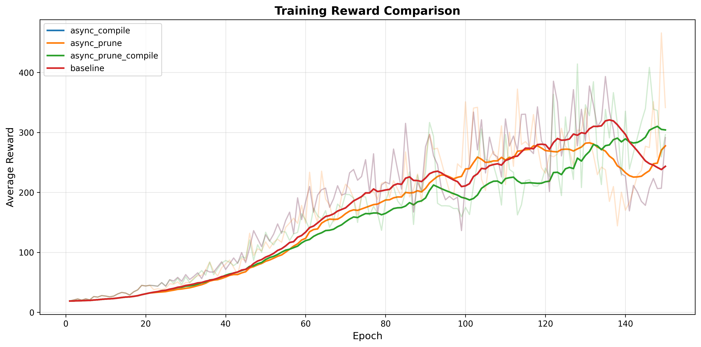

# RLlib Accelerator

This repository contains the code used in our HPML project on accelerating RLlib
training with PyTorch `torch.compile` and dynamic quantization. The project
focuses on the CartPole-v1 benchmark and provides end-to-end tooling for
benchmarking baseline PPO, synchronous compilation, asynchronous compilation
(with/without warmup), and asynchronous quantization with warmup.

## Quick Start

### Compile & Quantization Experiments

```bash
pip install -r requirements.txt          # include ray[rllib], torch>=2.1, matplotlib, wandb(optional)
python main.py                           # run all experiments enumerated in config.py
```

Key runtime controls live in `config.py`:

- `DEFAULT_HPARAMS`: environment name, batch sizes, learning rate (+ optional decay),
  model size, resource allocation, etc.
- `EXPERIMENTS`: list of scenarios to execute. Each entry specifies compile mode,
  compressor list, trigger cadence, warmup flag, whether the training backbone
  should be compiled, and device requirements.

### Pruning Experiments

```bash
# Run basic pruning experiments (baseline, compile, prune, prune+compile)
python scripts/run_pruning_experiments.py --experiment basic --seed 43 --wandb --wandb-project your-project-name

# Test different pruning ratios
python scripts/run_pruning_experiments.py --experiment ratios --epochs 150

# Plot results
python scripts/plot_pruning_results.py --log-dir logs/pruning_basic
```

Key pruning controls live in `config_pruning.py`:

- `prune_ratio`: Target sparsity (e.g., 0.15 for 15% pruning)
- `prune_technique`: Pruning strategy (magnitude, random)
- `prune_schedule`: Gradual pruning schedule (iterative)
- `trigger_every`: Prune every N epochs

## wandb links

### Compile

https://api.wandb.ai/links/mahm/6oytcqih

### Quantization

https://wandb.ai/gq2142-columbia-university/rllib-accelerator/reports/RL-Inference-Acceleration-Quantization--VmlldzoxNTQxOTUzMA

### Pruning

https://api.wandb.ai/links/fm2859-columbia-university/shlmnaw0

## Results

### Compile


Asynchronous compilation reduces steady-state iteration time by overlapping compilation with training. However, both sync and async compilation show early-epoch latency spikes due to first-inference overhead, which must be removed via warmup to achieve stable speedup.

### Quantization


- Speedup
  - Model size
    - Large dimensions: desirable
    - Small dimensions: limited
  - Hardware specific
    - CPU 2.5X: dynamic quantization
    - GPU 3.3X: weight-only quantization
- Reward
  - Weight-only quantization exhibits the most stable training behavior
  - Dynamic quantization accelerates inference but introduces a trade-off between speed and learning stability.
    - High-frequency quantization leads to reward instability, while lower frequency improves stability at the cost of slower convergence. Acceleration for small model is moderate, but is more significant for lager models.

### Pruning



Combining pruning with torch.compile (async_prune_compile) achieves the best performance gains with 3.4% higher throughput and 7.8% faster inference time, demonstrating that these techniques complement each other effectively. However, pruning introduces a reward trade-off, with pure pruning showing 4.6% degradation and pruning+compile showing 3.5% degradation compared to baseline, suggesting the 15% sparsity level moderately impacts learning capacity.

## Compression Modes

Each experiment is managed by `framework/trainer.py` and `framework/policy_manager.py`.
The policy manager owns a `CompressionController` that snapshots the local training
backbone, applies the configured compressor(s), and broadcasts models/weights to
rollout workers.

### 1. Baseline (no compile)

- `mode = CompileMode.NONE`.
- `compressors = ["compile"]` but the compression pipeline is never triggered.
- Trainer simply performs PPO rollouts/train steps and relies on RLlib's default
  `sync_weights()` to keep workers on-policy.

### 2. Compile

#### Sync Compile

- `mode = CompileMode.SYNC`.
- At the end of each epoch (or whenever the trigger policy fires), the controller
  takes a snapshot, runs `torch.compile` synchronously, and immediately swaps the
  compiled backbone into all rollout workers.
- Since the swap happens inside the training critical path, the epoch includes the
  compile latency; there is no overlap with rollout/learning time.

#### Async Compile

- `mode = CompileMode.ASYNC`.
- The controller snapshots the training backbone and launches a background thread
  that compiles the model. At the start of the next epoch, `maybe_swap()` checks
  whether a compiled result is ready:
  - If the compiled structure changed, it swaps the entire module on all workers.
  - Otherwise it reuses the compiled module and **only** pushes the latest weights.
- `PolicyManager.push_weight_update()` guarantees the rollout policy remains on
  the newest parameters even while the compiled module is reused, so async compile
  behaves like the baseline with a faster forward path.

#### Async Compile with Warmup

- Same as async compile, but `async_warmup=True`.
- After swapping the module the first time, every worker runs a dummy forward pass
  (`warmup_compiled_backbone()`) so that PyTorch captures the graph before real
  rollouts. This hides the first-iteration compilation overhead.

### 3. Quantization


#### Async Quant with Warmup

- `compressors = ["quant"]` (dynamic quantization on linear layers).
- Quantized modules cannot reuse training weights, so every swap transmits the full
  quantized backbone.
- `async_warmup=True` runs a dummy pass to prime CPU kernels. Trigger cadence and
  diff-threshold control how often re-quantization occurs.

#### Async Weight-Only Quant with Warmup

- Compresses model weights to INT8 while keeping activations in floating point.
- Evaluated exclusively on GPU, where mixed-precision GEMM kernels leverage Tensor Cores.

#### Async TensorRT Quant with Warmup

- Full post-training INT8 quantization with calibration.
- Quantizes both weights and activations and generates a TensorRT execution engine.
- Not evaluated in this study due to unavailable hardware configuration and calibration tooling.

### 4. Pruning

#### Async Prune with Warmup

- `compressors = ["prune"]` (magnitude-based structured pruning).
- Applies mask-based pruning to gradually remove weights based on magnitude criterion.
- Supports configurable pruning ratios (e.g., 15% sparsity), iterative pruning schedules, and both training/inference model pruning.
- Pruning is applied asynchronously with configurable trigger frequency (e.g., every 15 epochs).
- `async_warmup=True` ensures smooth transition when pruned models are swapped to workers.

#### Async Prune + Compile

- Combines pruning with torch.compile for maximum inference acceleration.
- The pruned model structure is compiled using `torch.compile` to optimize execution.
- Achieves best throughput gains by reducing model size (pruning) and optimizing execution graph (compile).
- Configuration controlled via `config_pruning.py` with parameters like `prune_ratio`, `prune_technique`, `prune_schedule`, and `trigger_every`.

## Benchmark & Plot Scripts

| Script                                                                              | Purpose                                                                                                                                                 |
| ----------------------------------------------------------------------------------- | ------------------------------------------------------------------------------------------------------------------------------------------------------- |
| `scripts/benchmark_compile.py`                                                      | Micro-benchmark vanilla vs. `torch.compile` inference (CPU/GPU).                                                                                        |
| `scripts/benchmark_quant.py`                                                        | Compare vanilla vs. dynamic quantized inference throughput (CPU).                                                                                       |
| `results/none&sync&async/plot_times.py`                                             | Plot total/rollout/train/inference time plus compile/swap latency for baseline vs. compile variants. Supports explicit file selection and image export. |
| `results/compile&quant&baseline/quality_comparison_layer=4_dim=512/plot_rewards.py` | Plot smoothed reward curves for any subset of experiments (labels + files configurable).                                                                |
| `results/compile&quant&baseline/plot_inference_bars.py`                             | Generate bar charts comparing rollout/inference time and throughput across the three inference-speed directories (`dim=512/1024/2048`).                 |
| `results/compile&quant&baseline/plot_swap_latency.py`                               | Visualize swap latency measurements recorded in `swap_time_rec.csv`.                                                                                    |

## Logging

- Each experiment writes a JSONL trace under `logs/{exp-name}/` and `results/...`
  directories. Every record contains:
  - `rollout_time`, `train_time`, `total_time`, `inference_time`, `throughput`
  - `compile_latency` (sync mode) or swap metadata (async mode)
  - Average reward per epoch
- Optional Weights & Biases logging is available via `DEFAULT_HPARAMS["use_wandb"]`
  plus `wandb_project`/`wandb_group`.

## Reproducing Custom Runs

1. Edit `config.py` to include the scenarios and hyper-parameters you want.
2. (Optional) set per-experiment `device` in `config.py` (or set `ACCEL_DEVICE=cuda:0`
   to override globally) to run training on GPU.
3. Run `python main.py`. Logs appear under `logs/` and `results/`.
4. Use the plotting scripts above to compare modes or tune quantization triggers.

## Notes

- RLlib PPO is sensitive to learning-rate and batch size. The config includes
  a simple LR decay schedule (`lr_decay`) and manual device selection to keep
  comparisons fair.
- As of this implementation, we focus on CPU rollouts. Training can optionally
  run on GPU; compilation/quantization pipelines run on whichever device the
  backbone resides.
